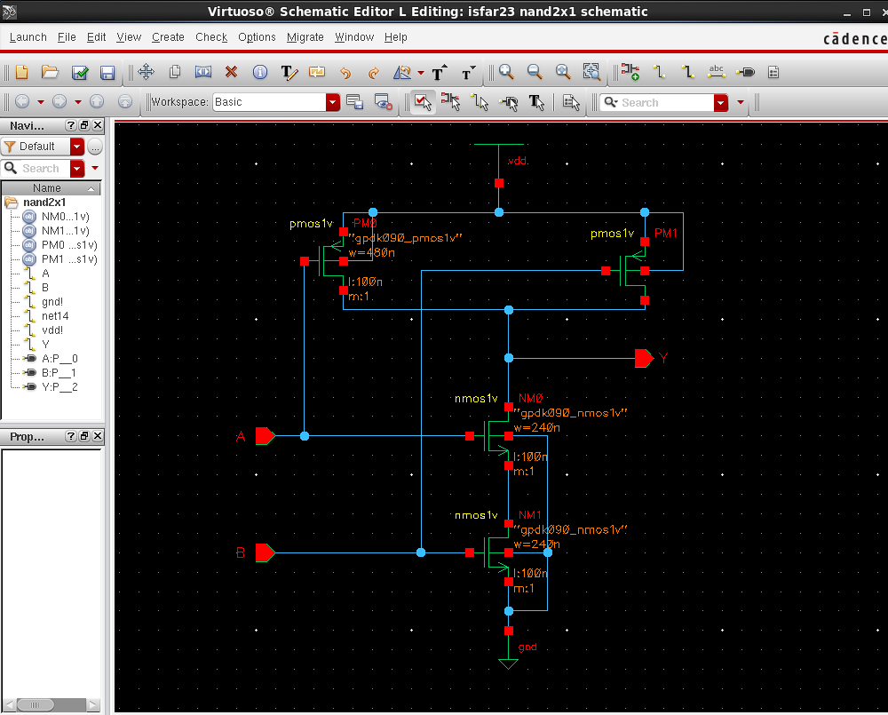
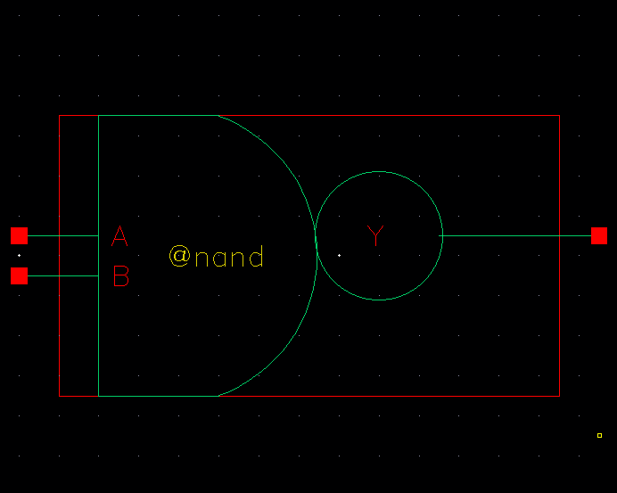
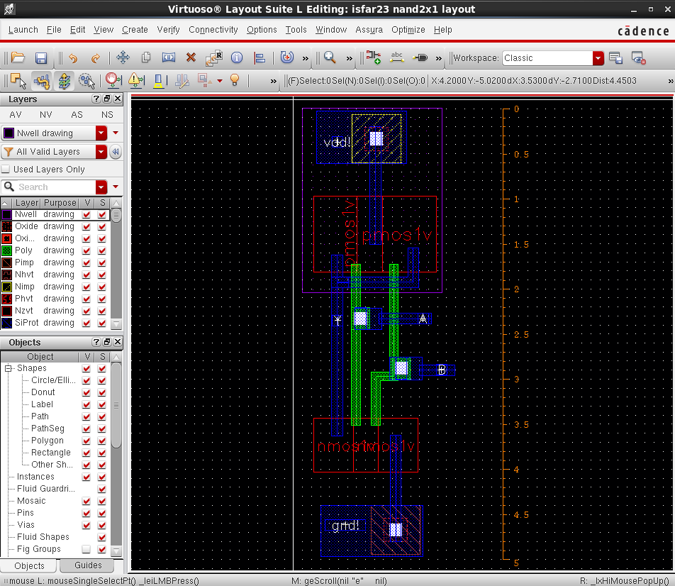
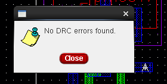
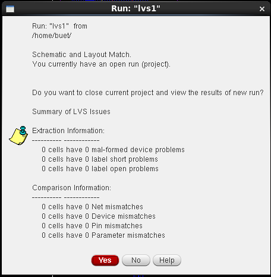
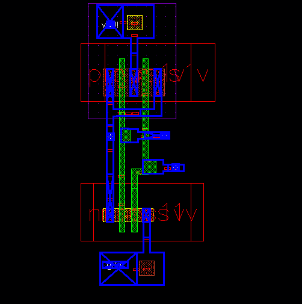
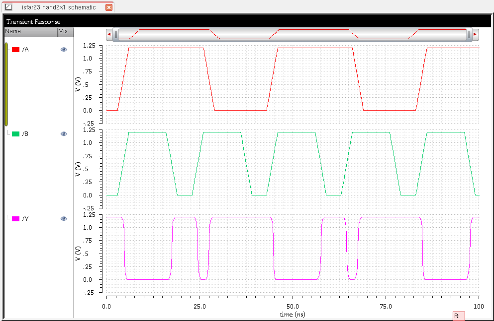

# Schematic Driven Layout Design of a NAND Gate Using Virtuoso Layout Suite Editor XL

## Objectives
- To familiarize with schematic-driven layout design.
- To perform schematic-level verification, DRC, and LVS.
- To perform post-layout simulation of a NAND Gate.

---

## Design Procedure
To design the schematic for a 2-input NAND gate (nand2x1), a new cell view was initiated from the CIW in Virtuoso Layout Editor XL. The design employed:

- **NMOS Transistors:** Width = 240 nm  
- **PMOS Transistors:** Width = 480 nm  
- **Connections:** Inputs A and B, Output Y, Ground (GND), and Power Supply (Vdd)

### Schematic Design
The schematic was created and simulated using ADE L to verify its functionality. After configuring the model library, selecting the analysis type, and plotting the outputs, the expected output Y was successfully obtained.

  

### Symbol Creation
After completing the schematic, a NAND gate symbol was created.

  

### Layout Design
Using Layout XL, the layout was created and wired up. The final layout is shown below:

  

### DRC & LVS Verification
- **DRC (Design Rule Check):** No errors found.
- **LVS (Layout vs. Schematic):** No mismatches detected.

  
  

### Post-Layout Simulation
After performing **RCX extraction**, the av_extracted view was created and simulated. The transient response of the extracted NAND gate matched expectations.

  
  

---

## Discussion
- The NAND schematic, symbol, layout, and av_extracted views were successfully generated in Virtuoso Layout Suite.
- An initial DRC error required parameter adjustments.
- LVS verification confirmed the consistency between the schematic and layout.
- After adjustments, the intended output waveform was successfully displayed.

---

## Conclusion
This experiment successfully demonstrated the complete flow of schematic-driven layout design, verification, and simulation for a NAND gate using Cadence Virtuoso.

---

## Contact
- LinkedIn: [Isfar Nayen](https://www.linkedin.com/in/isfar-nayen-0ba8ba341/)
- Kaggle: [Isfar Nayen](https://www.kaggle.com/isfarnayen)
- 🔗 GitHub: [Isfar Nayen](https://github.com/IsfarNayen)
- 📧 Email: isfar8953@gmail.com

---

## ⭐ Give a Star!
If you liked this project, consider giving it a star on GitHub! ⭐